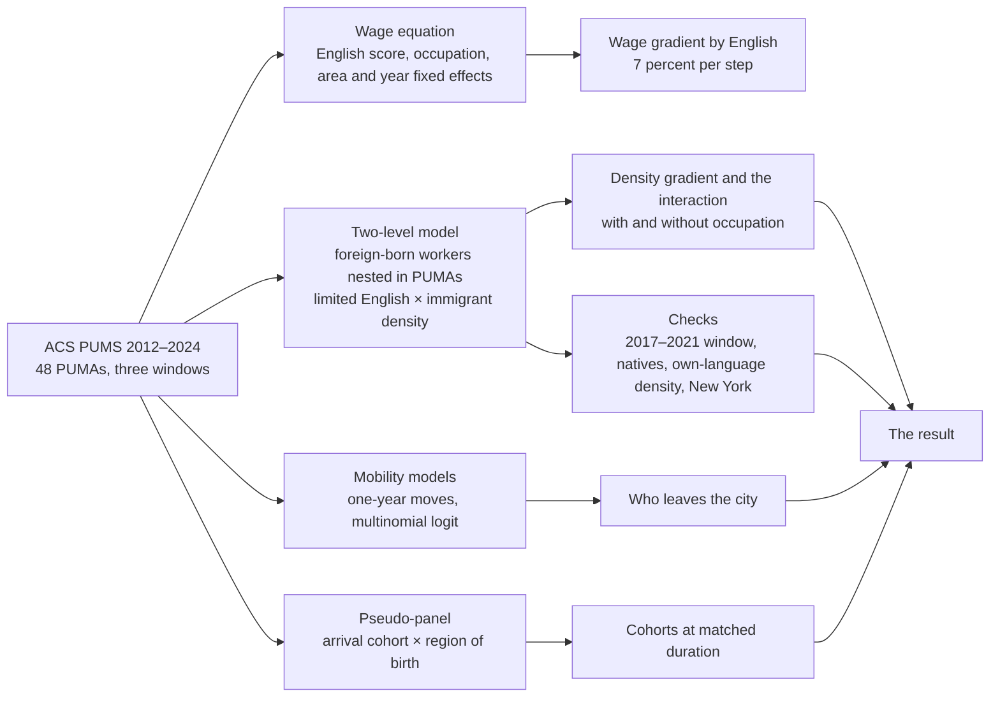

# mmigrant wages are lower in immigrant-dense areas in metropolitan Philadelphia，and the limited-English differential is mostly occupational.

Live site: http://phillyimmigrant.usllab.org/
Author: Hebe Liu, [Urban Spatial Lab](https://usllab.org/)

## The question

Two ideas about immigrant neighborhoods point in opposite directions. One says that living among other immigrants protects a worker who speaks little English, because employers, customers and networks in that area work in the worker's language. The other says the same area isolates that worker from the wider labor market and holds pay down. Both ideas make the same testable claim, that the wage gap between limited-English and proficient immigrants should change with how immigrant-dense the area is. The protective view expects the gap to shrink in dense areas, the isolation view expects it to grow.

This project asks three things about metropolitan Philadelphia. Does the limited-English wage gap change with the immigrant density of the area? If wages fall with density, is that a property of the immigrants or of the area? And do the higher earners leave the city for the suburbs, as the spatial assimilation model predicts?

## The process

The data are the American Community Survey public use microdata five-year files, used as three windows, 2012–2016, 2017–2021 and 2022–2024. The sample is wage and salary workers aged 25 to 64 in the 48 public use microdata areas of the Philadelphia-Camden-Wilmington metropolitan area, 240,089 worker-year observations in all, of which 29,299 are foreign-born and 7,355 are the foreign-born workers of 2022–2024 used in the area models. English proficiency is the four-point ACS self-report, and limited English means the two lowest answers. Area immigrant density is the foreign-born percentage of each PUMA's residents.

The main model is a two-level regression of the log hourly wage on limited English, immigrant density and their interaction, with workers nested in PUMAs and the limited-English gap allowed to vary from one PUMA to the next. The interaction term is the test. It is run again with occupation held constant, which shows how much of the gap comes from which occupations limited-English workers hold rather than from pay inside an occupation.

Four checks follow. The model is re-run on the 2017–2021 window and on native-born workers in the same areas. An exploratory version replaces immigrant density with the density of the worker's own home language. The whole set of models is repeated for the New York metropolitan area with the same sample rules, as a comparison rather than as part of the design.

The residential side uses the one-year migration question. A multinomial logit relates each type of move, within the city, within the suburbs, city to suburb and suburb to city, to pay, English and other characteristics. A pseudo-panel of arrival cohort by region of birth follows groups across the three windows, and a duration-matched comparison sets the 2010s arrivals against the 2000s arrivals at the same number of years after arrival.

## The result

Wages are lower in immigrant-dense areas. For immigrants who speak English well, hourly pay is about 8 percent lower per standard deviation of area immigrant density, a step of 5.4 percentage points. For immigrants with limited English the slope is about 3 percent and not distinguishable from zero. Native-born workers in the same areas show a slope of 2 percent, so about a quarter of the gradient is shared with natives or absorbed by the area's wage level, and the rest is specific to the foreign-born.

The limited-English gap does not change detectably with density. The interaction is 0.049 with a standard error of 0.029, the same size in 2017–2021, and its interval rules out a large isolating effect without ruling out a modest narrowing. Neither view gets clear support.

The gap itself is mostly occupational. Limited-English immigrants earn 21 percent less than proficient immigrants overall and 9 percent less inside the same occupation and area. Holding occupation constant removes about 60 percent of the gap, 40 percent of the density gradient and all of the interaction. Thirty-seven percent of limited-English workers are in service occupations, against 12 percent of the native-born.

The own-language check narrows the gap, but not in the way the protective view describes. Limited-English wages do not vary with own-language density. Proficient wages fall with it, by about 6 percent per standard deviation. New York shows the same pattern, and its two own-language estimates are the only ones among the seventeen interaction terms that survive a correction for that number of tests.

Higher earners leave the city. Foreign-born adults who moved from the city to a suburb in 2022–2024 earned a median of 33 dollars an hour, against 20 dollars for those who moved the other way, and doubling hourly pay raises the odds of leaving the city by about 40 percent among prior city residents. At matched duration, Latin American arrivals of the 2010s are 7 points less suburban than the 2000s cohort was, a shift toward the city that the spatial assimilation model does not predict.

## Data

U.S. Census Bureau, American Community Survey Public Use Microdata Sample, five-year files for 2012–2016, 2017–2021 and 2020–2024, the last restricted to interviews in 2022, 2023 and 2024. Wages are in the final-year dollars of each window, and descriptive comparisons across windows are converted to 2024 dollars with the CPI-U. Standard errors are clustered on PUMA-by-window, and the mobility models and the duration-matched comparison use the 80 ACS replicate weights.
